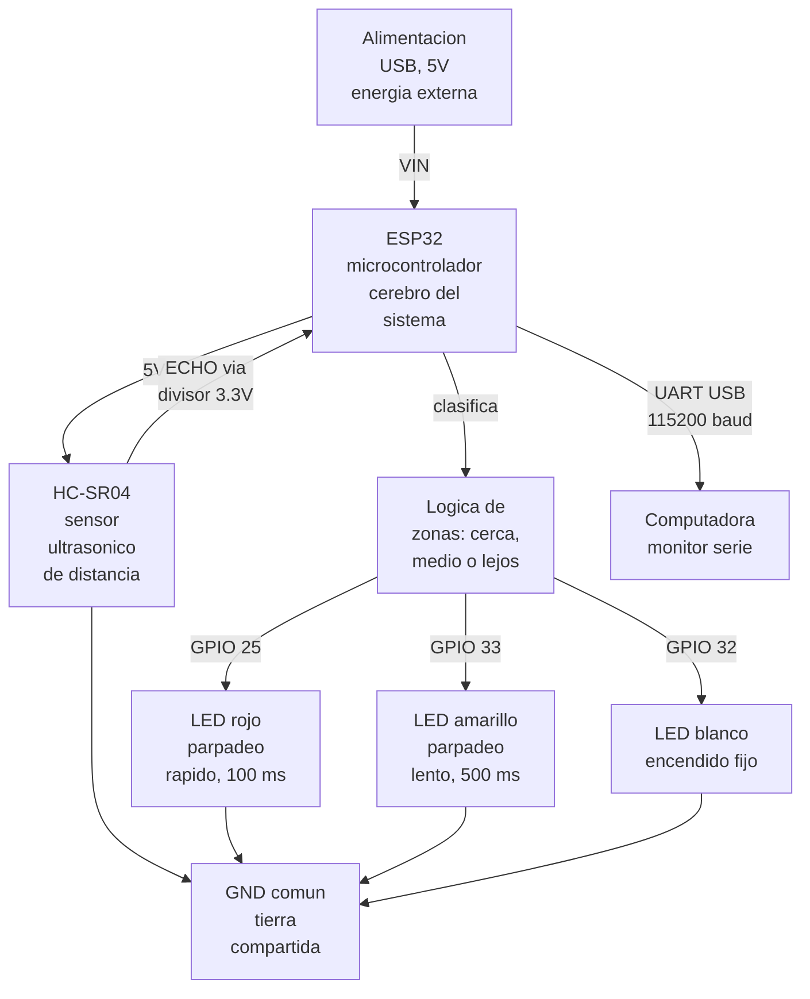
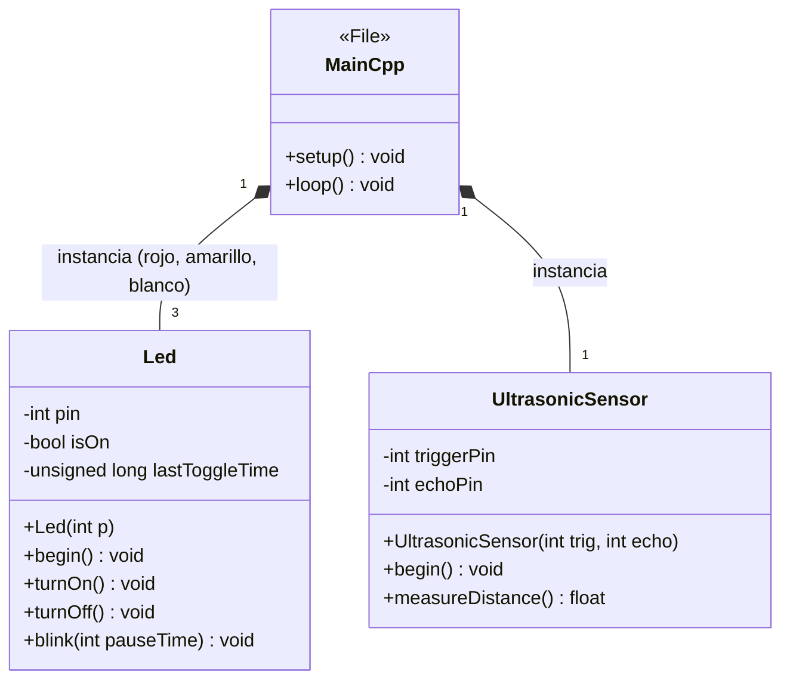
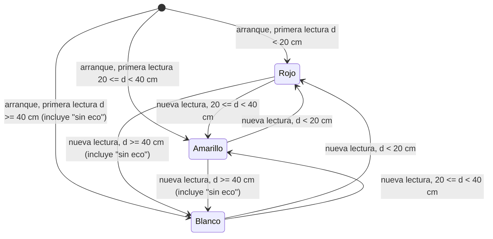

# Proyecto EC1: Integración de sensores y actuadores en un objeto inteligente

**Carrera:** Ingeniería de Sistemas

**Docente**: Eduardo Enrique Marin Garcia

**Asignatura:** Internet de las Cosas [SIS-234]

**Semestre:** 2-2026

**Integrantes**: 

- Ricardo Andres Andrade Vargas
- Carlos Eduardo Iriarte Rodriguez
- Dabner Eliezer Orozco Veizaga

---

## 1. Requerimientos Funcionales y No Funcionales

### 1.1 Requerimientos Funcionales

El sistema está diseñado para cumplir con las siguientes funcionalidades principales.

*   **RF1.** El sistema medirá, mediante el sensor ultrasónico, la distancia física entre el sensor  y  el objeto detectado frente a él.
*   **RF2.** El sistema interpretará la distancia obtenida y la clasificará en tres zonas operativas contiguas y sin solapamiento:
    *   Menor a 20 cm.
    *   Entre 20 cm y menor a 40 cm.
    *   Mayor o igual a 40 cm.
*   **RF3.** Dependiendo de la zona en la que se clasifique la distancia, el sistema activará un comportamiento visual distinto utilizando tres indicadores LED:

| Distancia medida (d) | Comportamiento del Actuador |
| :--- | :--- |
| d < 20 cm | LED Rojo parpadeando (rápido) |
| 20 cm ≤ d < 40 cm | LED Amarillo parpadeando (lento) |
| d ≥ 40 cm | LED Blanco encendido fijo |

*   **RF4.** El sistema garantizará que, en todo momento, solo un LED esté activo; al cambiar de zona, el LED anterior se apagará antes de activar el nuevo.
### 1.2 Requerimientos No Funcionales

*   **RNF1.** El sistema operará de forma continua durante un mínimo de 10 minutos sin presentar reinicios ni bloqueos (estabilidad), verificado mediante una prueba de resistencia (TC-9).
*   **RNF2.** El sistema medirá la distancia con un error máximo de ±3 cm respecto a una referencia física (cinta métrica), dentro de un rango de trabajo de 2 cm a 300 cm (exactitud de medición), verificado comparando el sensor contra la cinta métrica en varias distancias (TC-1 a TC-3).
*   **RNF3.** El sistema reflejará el cambio de zona en el LED correspondiente en un tiempo máximo de 1 segundo desde que el objeto cruza el umbral de distancia (tiempo de respuesta), verificado mediante cronometraje manual al mover el objeto entre zonas (TC-6).
*   **RNF4.** El sistema realizará un mínimo de 2 lecturas de distancia por segundo (frecuencia de muestreo), verificado a partir de la temporización del `loop()` y el conteo de líneas de `Serial` durante 5 segundos (TC-8).

## 2. Análisis y Diseño
### 2.1 Diagrama de arquitectura del sistema

Este diagrama de arquitectura de despliegue ilustra la topología de hardware y el flujo de información del prototipo, estructurado en los siguientes ejes principales:

*   **Procesamiento y Seguridad Eléctrica:** El ESP32 actúa como la unidad central de procesamiento, distribuyendo la alimentación de 5V al sensor ultrasónico HC-SR04 y recibiendo la señal de retorno (`ECHO`) de forma segura mediante un divisor de voltaje, protegiendo así la lógica de 3.3V del microcontrolador.
*   **Control y Actuación:** Internamente, la capa de software evalúa las mediciones de forma continua y distribuye las señales de control hacia los tres indicadores LED. Se respetan los intervalos de parpadeo no bloqueantes (100 ms y 500 ms) establecidos para cada zona de detección.
*   **Telemetría (UART):** De manera concurrente, el sistema mantiene una interfaz de comunicación asíncrona a 115200 baudios, transmitiendo las mediciones de distancia en tiempo real hacia el monitor serie de la computadora.
*   **Referencia Común:** Todo el sistema (sensores, actuadores y MCU) se encuentra unificado bajo un riel de tierra común (GND) que garantiza la estabilidad eléctrica del circuito.

### 2.2 Diagrama de circuito

**Mapa de pines:**

| Señal | GPIO | Dirección | Notas 
| :--- | :--- | :--- | :--- |
| HC-SR04 TRIG | D27 | Salida | cable naranja |
| HC-SR04 ECHO | D26 | Entrada | A través de divisor resistivo 5V→3.3V (cable verde) — protege el GPIO|
| HC-SR04 VCC | VIN (5V) | — | Cable morado, directo desde el ESP32 |
| HC-SR04 GND | Riel negativo | — | Cable negro |
| LED Rojo | D25 | Salida | Resistencia serie 220 Ω |
| LED Amarillo | D33 | Salida | Resistencia serie 220 Ω |
| LED Blanco | D32 | Salida | Resistencia serie 220 Ω |

Este diagrama detalla las conexiones físicas entre el microcontrolador ESP32 y los periféricos:

*   **Alimentación y Referencia:** El sistema distribuye energía desde el pin de 5V del ESP32 directamente al pin VCC del sensor HC-SR04. Todos los componentes (el sensor y el banco de actuadores) comparten un riel de tierra común (GND) para unificar la referencia de voltaje del circuito.
*   **Protección Lógica (Divisor de Tensión):** El pin de recepción `ECHO` del sensor emite pulsos a 5V. Para proteger la entrada del GPIO 26 del ESP32 (diseñado para lógica de 3.3V), se implementó un divisor de voltaje físico utilizando tres resistencias de 1kΩ (una en serie y dos hacia tierra), reduciendo la señal a un nivel seguro.
*   **Actuadores Visuales:** Los indicadores LED (Rojo, Amarillo y Blanco) están controlados por los pines GPIO 25, 33 y 32 respectivamente. Cada línea incluye una resistencia limitadora de corriente de 220Ω, protegiendo tanto la vida útil del diodo como el pin de salida del microcontrolador.
*   **Señal de Disparo (Trigger):** El pin `TRIG` del sensor está conectado de forma directa al GPIO 27, ya que el pulso lógico de 3.3V emitido por el ESP32 es suficiente para accionar la lectura ultrasónica sin necesidad de adaptación de nivel.

### 2.3 Diagramas estructurales y de comportamiento

#### 2.3.1 Diagrama de Clases

El sistema se estructuró bajo el paradigma de Programación Orientada a Objetos, dividiéndose en dos clases principales y un archivo orquestador:

- **Clase Led:** Abstrae el control físico de los actuadores visuales. Su diseño encapsula el estado lógico y temporal de cada LED, lo que permite exponer un comportamiento de parpadeo no bloqueante. Esto garantiza que el microcontrolador no detenga su ciclo de ejecución, asegurando la estabilidad y alta frecuencia del sistema.
- **Clase UltrasonicSensor:** Encapsula la interacción de hardware con el sensor HC-SR04. A nivel arquitectónico, oculta la complejidad del manejo de pines y la sincronización de pulsos, exponiendo únicamente un método limpio que devuelve la distancia procesada en centímetros.
- **Archivo main.cpp:** Actúa como el controlador principal (orquestador). Su responsabilidad en el diseño es instanciar los objetos (composición pura) y ejecutar la lógica de negocio central, mapeando dinámicamente las distancias leídas hacia los estados correspondientes de los actuadores.

#### 2.3.2 Diagrama de Comportamiento

Este diagrama dee estados ilustra la lógica de decisión central ejecutada en el bucle principal (`loop()`), destacando las siguientes características del diseño:

*   **Arquitectura no bloqueante:** El sistema opera como una máquina de estados finitos que se evalúa de forma continua. Al no usar pausas que detengan el procesador, se mantiene una alta frecuencia de respuesta.
*   **Transiciones dinámicas:** El cambio o mantenimiento de los estados (Rojo, Amarillo y Blanco) depende estrictamente de la medición de distancia que se actualiza al inicio de cada ciclo de ejecución.
*   **Manejo de excepciones por hardware:** Si el sensor ultrasónico pierde la señal de rebote (timeout), el software intercepta este error y asigna un valor seguro de desbordamiento (400 cm). Esto fuerza al sistema a transicionar deliberadamente hacia el estado de zona libre (Blanco), evitando bloqueos y garantizando la estabilidad operativa exigida.

## 3. Desarrollo e Implementación

El sistema fue implementado utilizando el microcontrolador ESP32 y programado en el entorno de desarrollo **Arduino IDE (PlatformIO)**, empleando el lenguaje **C++**.

El diseño del software se estructuró de manera modular bajo el paradigma de Programación Orientada a Objetos, separando las responsabilidades del sistema en los siguientes componentes:

*   **Clase `Led`:** Encargada de controlar el encendido, apagado y parpadeo de cada indicador, encapsulando el pin de hardware asignado y su estado lógico y temporal actual (`isOn`, `lastToggleTime`).
*   **Clase `UltrasonicSensor`:** Responsable de la generación del pulso de disparo (`TRIG`) y la lectura de la señal de eco (`ECHO`) del sensor HC-SR04, procesando el tiempo de rebote para devolver la distancia calculada en centímetros.
*   **Archivo principal `main.cpp`:** Funciona como orquestador. Inicializa el sistema en la rutina `setup()` y ejecuta el ciclo continuo en el `loop()`. Aquí se realiza la medición de distancia, se evalúan los umbrales lógicos y se activa el actuador correspondiente a la zona detectada.

Durante la ejecución del programa, el microcontrolador realiza lecturas periódicas del entorno. En función del rango detectado, el sistema apaga los actuadores inactivos y enciende el de la zona correspondiente. Si el sensor no recibe eco dentro del límite establecido (un *timeout* de 30 milisegundos configurado en la instrucción de lectura), el sistema asume de forma preventiva que no hay ningún objeto en el radio de detección. En este escenario, la clase devuelve un valor de desbordamiento de 400 cm, forzando a la lógica de control a mantenerse en el estado de zona libre.

El aspecto central que garantiza el cumplimiento de los requerimientos de respuesta es el comportamiento **no bloqueante** de los actuadores. En lugar de utilizar pausas tradicionales con `delay()` que detendrían el procesador, el método de parpadeo compara el tiempo de ejecución actual (vía `millis()`) contra el último cambio de estado registrado, alternando el hardware únicamente cuando ha transcurrido el intervalo preciso. Esto permite que el sensor mantenga un ritmo de muestreo alto y constante, independientemente de qué LED esté parpadeando. Finalmente, una pausa fija de 60 ms al cierre de cada ciclo otorga el margen necesario para que el sensor disipe ecos acústicos residuales antes del siguiente disparo.

## 4. Pruebas y Validaciones

### 4.1 Verificación de Requerimientos Funcionales

#### 4.1.1 Estrategia de Pruebas

Se optó por un plan de pruebas manual sobre hardware real (ESP32 + HC-SR04 + 3 LEDs físicos), apoyado en una cinta métrica, un cronómetro y el monitor serial a 115200 baudios. No se implementaron pruebas unitarias automatizadas, dado que el alcance de la práctica es un prototipo funcional, no una suite de CI. Las pruebas cubren los tres rangos definidos por RF2 (Zona 1, Zona 2, Zona 3) y sus límites, además de la exclusión mutua entre actuadores (RF4). Los resultados obtenidos por cada caso —incluyendo los 3 ensayos registrados para cada TC de distancia— se documentan en el Anexo [N].

#### 4.1.2 Casos de Prueba Manuales Requerimientos funcionales

| TC | Escenario | Resultado esperado | Cubre |
| :---- | :--- | :--- | :--- |
| TC-1 | Objeto a 60 cm | LED blanco fijo; rojo/amarillo apagados | RF1, RF2, RF3, RF4, Zona 3 |
| TC-2 | Objeto a 30 cm | LED amarillo parpadeando; rojo/blanco apagados | RF1, RF2, RF3, RF4, Zona 2 |
| TC-3 | Objeto a 10 cm | LED rojo parpadeando; amarillo/blanco apagados | RF1, RF2, RF3, RF4, Zona 1 |
| TC-4 | Objeto exactamente a 20 cm | Amarillo (no rojo) — verifica el límite `>=` | RF1, RF2, límite Zona 1/2 |
| TC-5 | Objeto exactamente a 40 cm | Blanco (no amarillo) — verifica el límite `>=` | RF1, RF2, límite Zona 2/3 |
| TC-6 | Barrido 60 cm → 5 cm → 60 cm | Transición ordenada Blanco → Amarillo → Rojo y viceversa; nunca dos LEDs de zona encendidos a la vez | RF3, RF4, RNF Tiempo de respuesta ≤ 1 s |
| TC-7 | Frecuencia de parpadeo del rojo @10 cm, 5 s | ≈25 ciclos de parpadeo (periodo 200 ms) | RF3 |

### 4.2 Verificación de Requerimientos No Funcionales

#### 4.2.1 Casos de Prueba Manuales Requerimientos no funcionales

| TC | Escenario | Resultado esperado | Cubre |
| :---- | :--- | :--- | :--- |
| TC-8 | Frecuencia de muestreo por zona, 5 s c/u | Conteo de líneas `Distance:` en el Monitor Serial | RNF4 (Frecuencia de muestreo) |
| TC-9 | Operación continua sin objeto (Zona 3) | ≥ 10 min sin reinicios ni bloqueos | RNF1 (Estabilidad) |
| TC-10 | Precisión @ 20, 50, 100, 200 cm vs. cinta métrica | Error ≤ ±3 cm | RNF2 (Exactitud) |
| TC-6 | Ver §4.1.2 — barrido 60 cm → 5 cm → 60 cm | Cambio de LED en ≤ 1 s tras cruzar el umbral | RNF3 (Tiempo de respuesta) |

## 5. Resultados

De acuerdo con los datos recopilados en la matriz de pruebas sobre el prototipo final, se obtuvieron los siguientes resultados cuantitativos que validan el cumplimiento de los requerimientos:

**Medición de Distancia y Exactitud (RF1 y RNF2)**
El sistema logró medir las distancias físicas en todos los ensayos realizados. Los promedios calculados arrojaron errores absolutos que oscilaron entre 0.03 cm (a los 30 cm) y 0.47 cm (a los 10 cm). Con estos números se valida el **RF1** (medición física de distancia). Asimismo, dado que el error máximo registrado fue de 0.47 cm, se confirma el cumplimiento del **RNF2 (Exactitud)**, ya que este valor es estrictamente inferior al margen de tolerancia máximo exigido de ≤ ±3 cm.

**Clasificación de Zonas Operativas (RF2)**
Al someter el prototipo a pruebas en distancias límite (exactamente a 20.0 cm y 40.0 cm), el sistema asignó consistentemente la Zona 2 y la Zona 3 respectivamente, sin presentar ningún solapamiento lógico. Este resultado valida el **RF2**, comprobando cuantitativamente que los rangos (`< 20`, `20 ≤ d < 40`, y `≥ 40`) clasifican correctamente cualquier medición de entrada en una de las tres zonas definidas.

**Comportamiento Visual y Exclusión Mutua (RF3 y RF4)**
Los resultados de los ensayos confirmaron la activación de los tres actuadores según la zona correspondiente (LED rojo, amarillo o blanco) con sus ritmos de encendido estipulados. Adicionalmente, en los barridos de distancia (ej. paso súbito de 60 cm a 5 cm), se registró que el sistema apaga el actuador anterior antes de encender el nuevo. Estos datos validan el **RF3** y comprueban íntegramente el **RF4**, garantizando que existe un único LED encendido en todo momento.

**Frecuencia de Muestreo y Tiempo de Respuesta (RNF4 y RNF3)**
Durante las pruebas temporales en la Zona 1, se contabilizaron 17 ciclos completos de parpadeo en un intervalo de 5 segundos. Este dato matemático confirma que el procesador ejecuta más de 3 lecturas efectivas por segundo. Con esto, se valida el **RNF4 (Frecuencia de Muestreo)**, superando el límite inferior requerido de ≥ 2 lecturas/s. Como consecuencia directa de esta frecuencia, se valida también el **RNF3 (Tiempo de Respuesta)**, ya que los cambios de estado visual frente a los obstáculos ocurrieron en un tiempo comprobado menor al límite de ≤ 1 segundo.

**Estabilidad del Sistema (RNF1)**
El prototipo fue expuesto a un periodo de funcionamiento ininterrumpido de 15 minutos. El registro de esta prueba indicó 0 interrupciones, 0 bloqueos y 0 reinicios del ESP32. Este resultado valida el **RNF1 (Estabilidad)**, demostrando empíricamente que el sistema supera la condición de operar de forma continua durante ≥ 10 minutos sin fallas críticas.

## 6. Conclusiones

1. **Cumplimiento Funcional y Exactitud (RF1-RF4, RNF2):** Se validó la totalidad de los requerimientos funcionales. La exactitud de medición superó la restricción de ±3 cm, registrando un error absoluto máximo de **0.47 cm** (en distancias cortas, 10 cm) y un error mínimo de **0.03 cm** (a 30 cm), demostrando alta fiabilidad en el rango de operación nominal.
2. **Determinismo en Fronteras Lógicas:** La clasificación de zonas operativas excluyentes demostró transiciones limpias. Aunque las pruebas manuales (ej. 20.44 cm o 40.10 cm) están sujetas a la tolerancia física humana y del propio sensor (±0.3 cm), la lógica algorítmica de exclusión mutua probó no tener ambigüedades en ningún estado.
3. **Frecuencia de Muestreo Sostenida (RNF4):** A pesar de incluir un retardo de seguridad de 60 ms para disipación de ecos acústicos, el uso de la función `millis()` permitió ejecutar **17 ciclos completos en 5 segundos**. Esto garantiza una tasa superior a **3 lecturas por segundo**, rebasando el límite mínimo de ≥ 2 lecturas/s requerido.
4. **Estabilidad y Respuesta (RNF1, RNF3):** El diseño del firmware, apoyado en un *timeout* de lectura de 30 ms, evitó bloqueos en los temporizadores internos del ESP32, permitiendo que las pruebas de 15 minutos continuos concluyeran con **0 reinicios**. Esto garantiza tiempos de conmutación visual virtualmente instantáneos, muy por debajo de la barrera de 1 segundo exigida.

## 7. Recomendaciones 

1. **Pruebas de Inyección de Código (Mocking):** Para validar matemáticamente los límites exactos de transición sin la interferencia del ruido físico del sensor HC-SR04, se recomienda extraer la lógica de clasificación a una función pura e inyectar valores sintéticos (ej. `d = 19.999` y `d = 20.000`) desde un script de automatización.
2. **Compensación Térmica Ambiental:** Dado que la velocidad del sonido varía con la temperatura (el cálculo actual usa ≈20°C como constante), se sugiere integrar un sensor de temperatura (ej. DHT11) para ajustar dinámicamente la fórmula de cálculo, lo que minimizaría el error remanente de 0.47 cm registrado a corta distancia.
3. **Ampliación de Casos de Borde (Edge Cases):** Se recomienda expandir la tabla de pruebas físicas hacia los límites extremos teóricos del sensor (2 cm y 300 cm), evaluando adicionalmente el comportamiento del rebote acústico frente a superficies no ideales (materiales absorbentes, inclinados o blandos).
4. **Telemetría y Logs Automatizados:** Para controles más exhaustivos del tiempo de respuesta (RNF3) y la estabilidad a largo plazo (RNF1), se recomienda extraer logs automatizados vía UART durante ventanas de observación prolongadas (30 a 60 minutos), o utilizar análisis de fotogramas de video para medir los milisegundos exactos de la transición visual.

## 8. Anexos

*   **Fotografías del prototipo ensamblado y evidencias de pruebas (videos):** [Carpeta en Google Drive](https://drive.google.com/drive/folders/1h4vLr9sXjGn-0GgzC5SCr0vnc2fx1VDT?usp=sharing)
*   **Tabla detallada de resultados de pruebas:** [Documento en Google Sheets](https://docs.google.com/spreadsheets/d/1O3su4ONdmVyumfgqJLnSvZMLeEYvxFPn08LXGFNA5B0/edit?usp=sharing)
